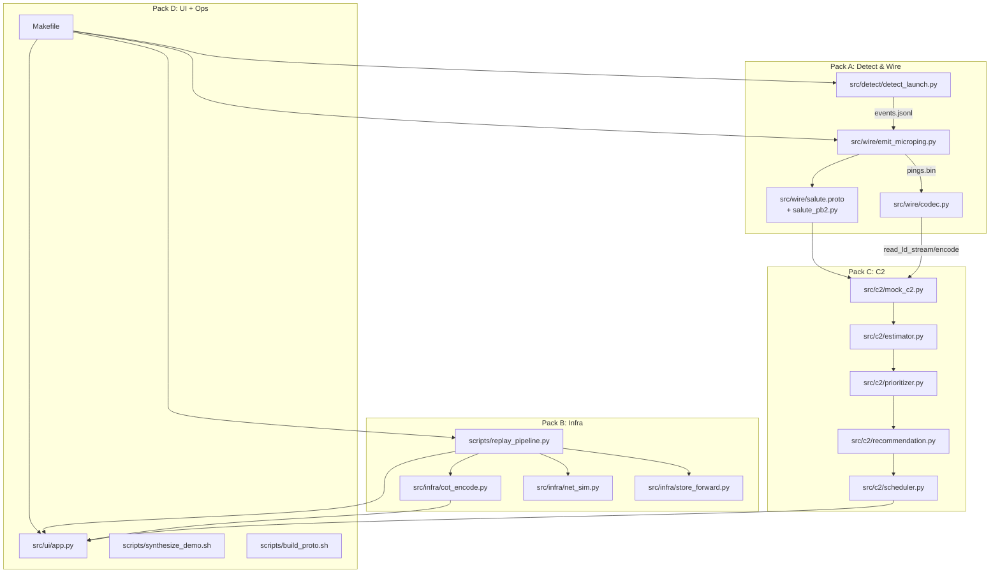

# Field Evidence – Architecture

This document describes how the system runs end-to-end across four packs:
- Detect + Wire (pre‑C2) — event detection from labeled frames and SALUTE microping emission.
- Infra — store‑and‑forward queue, connectivity simulation, CoT encoding, replay.
- C2 — receiver/normalizer, estimator, risk, recommendation, scheduler.
- UI + Ops — Streamlit app, scripts, and Make targets.

All file paths below refer to real files in this repo (e.g., `src/wire/emit_microping.py`).


## End‑to‑End Flow (Pre‑C2 → C2)

- Detect launch events (labels‑only): `src/detect/detect_launch.py`
  - Inputs: clip manifests `data/synthetic/clip_*.json`, labels CSV `data/labels/*.csv`.
  - Output: one JSON per detected event to `out/events.jsonl` with fields `{uid, frame, ts_ns, lat, lon, event_code=1, conf}`.
  - Optional outputs: annotated viz MP4s to `out/viz/*.mp4`, a single per‑uid snip to `out/snips/<uid>_event_f####.mp4`.
- Emit SALUTE micropings: `src/wire/emit_microping.py`
  - Input: `--events out/events.jsonl`.
  - Output: varint length‑delimited Protobuf stream to `out/pings.bin`; size stats JSON to `out/ping_sizes.json`.
  - Uses `src/wire/salute.proto` + `src/wire/salute_pb2.py` and varint framing in `src/wire/codec.py`.
- Store‑and‑forward replay & network sim: `scripts/replay_pipeline.py`, `src/infra/store_forward.py`, `src/infra/net_sim.py`
  - Loads `out/pings.bin`, enqueues into SQLite `out/queue.db`, then drains at 1 Hz while "online" → appends sent payloads to `out/sent.bin`.
  - Writes monitor snapshots to `out/monitor.jsonl` each tick.
- CoT XML emission (demo pipeline):
  - Script path: `scripts/emit_cot_from_pings.py` (CLI) using `src/infra/cot_encode.py` helpers.
  - Output: `out/cot/uid_<uid>_<tsns>.xml` with point(lat/lon) and remarks including `event_code` and `hash_len`.
  - The infra app (`src/infra/replay_in_app.py`) can also encode CoT on successful sends and watch CoT files to trigger snip creation via `src/infra/snips.py`.
- C2 decision chain: `src/c2/mock_c2.py` (receiver) → `src/c2/estimator.py` (Tracker) → `src/c2/prioritizer.py` → `src/c2/recommendation.py` → `src/c2/scheduler.py`
  - Input sources: either SALUTE pings from `out/pings.bin` (decoded via `src/wire/codec.read_ld_stream` + `decode_ping`) or raw events from `out/events.jsonl`.
  - Normalized event output: `out/c2_feed.jsonl` with `{event_id, uid, ts_ns, lat, lon, event_code, conf, intent_score}`.
  - Scheduler writes audit timeline to `out/c2_audit.jsonl` with dispatch states.
- UI (optional but typical): `src/ui/app.py`
  - Reads `out/monitor.jsonl`, `out/ping_sizes.json`, `out/metrics.json`, `out/c2_feed.jsonl`, and CoT XMLs under `out/cot/*.xml`.
  - Renders map markers, metrics, decision panel, and the latest video (prefers `out/snips`, else `out/viz`).


## Data Contracts (Authoritative Shapes)

- Labels CSV (input to detection) parsed in `src/detect/detect_launch.py`:
  - T3 schema: `frame,carrier_x,carrier_y,carrier_w,carrier_h,para_x,para_y,para_w,para_h[,event]`.
  - Debug schema: `frame,carrier_cx,carrier_cy,carrier_w,carrier_h,para1_x,para1_y,para1_w,para1_h,[...]`.
  - Normalized per‑frame dict: `{frame:int, cx:float, cy:float, cw:float, ch:float, px:float, py:float}`.
- Clip manifest JSON (input): `data/synthetic/clip_*.json`
  - Keys used: `uid`, `fps`, `geo.lat`, `geo.lon`, `geo.dpp_lat`, `geo.dpp_lon`.
- Event JSONL (output of detection): `out/events.jsonl`
  - One JSON per event: `{uid, frame:int, ts_ns:int, lat:float, lon:float, event_code:int, conf:float}`.
- SALUTE Protobuf (`src/wire/salute.proto`) and payload bytes packing (`src/wire/codec.py`)
  - Message `SalutePing`: `uid:fixed64, ts_ns:fixed64, lat_q:sfixed32, lon_q:sfixed32, geo_conf_m:fixed32, event_code:uint32, hash_pref:bytes(4–8)`.
  - Length‑delimited stream: `varint(len) + protobuf_bytes` repeated; see `write_ld_stream`/`read_ld_stream`.
- Queue database: `out/queue.db` (SQLite)
  - Table `queue(seq INTEGER PRIMARY KEY, ts_ns INTEGER, payload BLOB, status INTEGER DEFAULT 0)`.
- Monitor snapshots: `out/monitor.jsonl`
  - Per‑tick JSON: `{t_ns, depth, sent_tot, sent_1s, oldest_ms|null, p50_e2e_ms, p95_e2e_ms, p50_drain_ms, p95_drain_ms, online}`.
- C2 normalized feed: `out/c2_feed.jsonl`
  - `{event_id:str, uid:str, ts_ns:int, lat:float, lon:float, event_code:int, conf:float, intent_score:float}`.
- CoT XML events: `out/cot/uid_<uid>_<tsns>.xml`
  - `<event ... uid="uid_<uid>" time="..."><point lat="..." lon="..."/><detail><remarks>event_code=N hash_len=M</remarks></detail></event>`.
- Decision latency metrics: `out/metrics.json`
  - `{"decision_latency": {"p50_ms": float|null, "p95_ms": float|null, "n": int}}` produced by `src/utils/metrics.py`.
- Payload size stats: `out/ping_sizes.json`
  - `{"sizes":[...], "p95": int|null, "max": int|null}` maintained by `src/c2/mock_c2.py` and `src/wire/emit_microping.py`.


## Key Algorithms (Highlights)

- Detection heuristics `src/detect/detect_launch.py`:
  - Distance ratio: `ratio = hypot(px-cx, py-cy)/max(cw,1e-6)`.
  - Optional sliding corr gate over positions/velocities with lag sweep; final `corr = min(abs(rx), abs(ry))` across axes.
  - Two‑path trigger with streaks: Gate A (ratio > `--dist_ratio` AND corr < `--corr_thr`) for k; Gate B fallback (ratio > `--ratio_hi` AND Δratio > `--ratio_slope_thr`) for `--k_fallback`.
  - Confidence: Gate A → `(1 - min(corr,1.0)) * min(1.0, ratio/dist_ratio)`; Gate B → `min(1.0, (ratio - ratio_hi)/max(0.02, ratio_slope_thr*win))`.
  - Geo/time synthesis per frame using manifest `fps`, `dpp_lat/lon`.
- Microping encoding `src/wire/emit_microping.py`:
  - `uid64 = low_64_bits(sha256(f"{uid}:{frame}"))`; `lat_q/lon_q = int(round(deg*1e7))` clamped to int32; `geo_conf_m = 50`.
  - `hash_pref`: SHA‑256 prefix over canonicalized event JSON, try 6 bytes then 4 bytes to keep payload ≤ 80B; error out if still oversize.
  - Writes `out/pings.bin` via `src/wire/codec.write_ld_stream`.
- Store‑and‑forward `src/infra/store_forward.py`:
  - Drain loop with overall `budget_ms`; marks sent items, tracks end‑to‑end and drain‑only latencies; robust DB init/clear.
- C2 computation:
  - `src/c2/estimator.py`: 30s sliding window; velocity from last two points; confidence decays by Δt and sample count.
  - `src/c2/prioritizer.py`: distance/heading/approach; TTI from closing speed; composite score from intent/proximity/recent/geo_bonus with thresholds and hard rules.
  - `src/c2/recommendation.py`: policy gate to INTERCEPT/OBSERVE/LOG and message/action; compute bearing/ETA where applicable.
  - `src/c2/scheduler.py`: asset allocation, intercept point projection, and three‑state audit timeline.


## Diagram — Full Data Flow

```mermaid
flowchart LR
  subgraph Detect
    M[clip_*.json\n(data/synthetic)] -- load_manifest --> DL[src/detect/detect_launch.py]
    L[labels/*.csv\n(data/labels)] -- load_labels_csv --> DL
    DL -- events.jsonl --> E[out/events.jsonl]
    DL -- viz (opt) --> V[out/viz/*.mp4]
    DL -- snip (opt) --> S[out/snips/*.mp4]
  end

  subgraph Wire
    E -- --events --> EM[src/wire/emit_microping.py]
    EM -- pings.bin --> PB[out/pings.bin]
    EM -- size stats --> PS[out/ping_sizes.json]
    EM -. uses .-> P[src/wire/salute.proto\n+ salute_pb2.py]
    EM -. framing .-> C[src/wire/codec.py]
  end

  subgraph Infra
    PB --> RP[scripts/replay_pipeline.py]
    RP --> Q[out/queue.db]
    RP --> MON[out/monitor.jsonl]
    RP --> SENT[out/sent.bin]
    RP -. CoT encode (script/app) .-> COT[out/cot/uid_*.xml]
  end

  subgraph C2
    PB -- read_ld_stream + decode_ping --> RX[src/c2/mock_c2.py]
    E -- normalize_event_dict --> RX
    RX --> FEED[out/c2_feed.jsonl]
    FEED --> EST[src/c2/estimator.py]
    EST --> RISK[src/c2/prioritizer.py]
    RISK --> RECO[src/c2/recommendation.py]
    RECO -- INTERCEPT --> SCH[src/c2/scheduler.py]
    SCH --> AUD[out/c2_audit.jsonl]
  end

  subgraph UI
    MON --> UI[src/ui/app.py]
    FEED --> UI
    COT --> UI
    PS --> UI
    V --> UI
    S --> UI
  end
```


## Diagram — Component Relationships




## Pack Details

- Detect (`src/detect/detect_launch.py`)
  - CLI args include `--mode, --in, --labels, --out, --viz, --use_corr, --ratio_hi, --ratio_slope_thr, --k_fallback, --clip_*`.
  - Failure handling: skips missing manifests/labels; `--strict` exits 2 on zero events; viz/snips are best‑effort (OpenCV/ffmpeg optional).
- Wire (`src/wire/emit_microping.py`, `src/wire/codec.py`, `src/wire/salute.proto`)
  - Validates JSON lines and required fields; length limit enforced per‑message; retries 6→4 byte `hash_pref` on overflow before erroring.
  - `src/wire/codec.py` validates schema and event_code in {1,2,3}; raises `ValueError` on truncation or decode errors.
- Infra (`scripts/replay_pipeline.py`, `src/infra/*`)
  - `store_forward.drain(...)` respects online state (`src/infra/net_sim.py`), measures E2E and drain latencies, appends to monitor.
  - CoT helpers: `src/infra/cot_encode.py`; CoT watcher/snips in `src/infra/replay_in_app.py` + `src/infra/snips.py`.
- C2 (`src/c2/*`)
  - Receiver tails pings/events with backlog; robust JSON/varint/protobuf error handling; writes rolling payload size metrics.
  - Estimator/risk/reco/scheduler compose decision with policy gates; audit timeline emitted to `out/c2_audit.jsonl`.
- UI (`src/ui/app.py`)
  - Loads monitor, feed, CoT, metrics; renders map and video; orchestrates optional background replay/toggler; degrades gracefully if optional deps missing.


## Config & Policy

- Central config: `config.yaml`
  - `asset_speed_mps` — speed used to infer intent and compute ETA.
  - `weights.intent/proximity/recent/geo_bonus` — risk scoring weights.
  - `thresholds.IMMEDIATE_score/SUSPECT_score` — composite class thresholds.
  - `immediate_rules.*` — hard gates based on TTI, intent, confidence, geofence.
  - `assets.protected_lat/protected_lon/geofence_radius_m` — geofence for proximity bonus and rules.
  - `target.lat/lon` — default target for risk computation; UI passes through.
  - `policy.recommend_min_status` — gate to INTERCEPT/OBSERVE/LOG; `suspect_monitor_window_sec`.
  - `c2.demo_mode/promote_after_sec/require_new_event` — state re‑eval behavior.
- Operational toggles (via Make/CLI env): `USE_CORR`, `RATIO_HI`, `RATIO_SLOPE_THR`, `K_FALLBACK`, `PATTERN`, `LIMIT`, `BUDGET_MS`, etc. (see `Makefile`).


## Metrics & SLOs

- Queue & drain (from `out/monitor.jsonl`):
  - Depth, sent per tick, oldest pending age, `p50/p95` E2E and drain latencies, online flag.
- Wire payloads: `out/ping_sizes.json` rolling samples with `p95` and `max`.
- Decision latency: `out/metrics.json` `decision_latency.p50_ms/p95_ms/n` via `src/utils/metrics.py`.
- Example SLOs (TBD; adjust per deployment):
  - Microping payload ≤ 80 bytes (hard limit; enforced).
  - Replay drain p95 E2E latency ≤ 100 ms under online windows (TBD workload).
  - Decision latency p95 ≤ 150 ms for typical demo datasets (TBD hardware).


## Risks & TODOs

- Proto path mismatch: `scripts/build_proto.sh` expects `proto/salute.proto` but repo has `src/wire/salute.proto`. Update script or relocate proto (authoritative path: `src/wire/salute.proto`).
- Strict gRPC version gate: `src/wire/salute_pb2_grpc.py` enforces `grpcio>=1.66.1`; not used by this pipeline, but importing it on an older version would raise.
- Duplicate encoding paths: `src/wire/emit_microping.py` constructs pings directly rather than reusing `src/wire/codec.encode_ping` — potential divergence.
- Sensitivity defaults: `--use_corr=0` and `--k_fallback=1` can fire on single‑frame spikes; fine for demo but may raise false positives.
- Heartbeat disabled: `start_heartbeat()`/`stop_heartbeat()` no‑ops and `_run_heartbeat()` unused in `src/infra/replay_in_app.py`.
- Monitor globals: heartbeat path references `_SENT_TOT/_SENT_1S` not updated by scheduler; could show zeros outside scheduler writes.
- Minor API footgun: `delayed_snip(mp4_src)` calls `_make_snip_from_event` with a wrong signature (unused path).
- OpenCV dependency: required for snips; absence prevents snip creation.
- SQLite usage: mixed global and ad‑hoc connections; WAL mitigates, but concurrency assumptions are demo‑level.
- Pattern parsers differ (app vs CLI) for truthy strings; could diverge on ambiguous inputs.
- Path roots assume `ROOT = Path(__file__).resolve().parents[2]`; moving directory depth can break output discovery.
- Makefile duplication: `proto` target definition appears twice; works on GNU make but adds maintenance risk.


## Onboarding Quickstart

- Prereqs: Python 3.11+ recommended; `ffmpeg` for clips; optional `opencv-python` for viz/snips.
- Setup:
  - `bash scripts/activate.sh`  # creates/activates `.venv` and sets `PYTHONPATH`
  - `pip install -r requirements.txt`
- Generate demo data (optional):
  - `make synth`  # or run `scripts/synthesize_demo.sh`
- Detect events (labels‑only):
  - `make detect`  # writes `out/events.jsonl`, `out/viz/*.mp4`, and one snip per uid under `out/snips/`
- Emit SALUTE micropings:
  - `make emit`    # writes `out/pings.bin` and `out/ping_sizes.json`
- Generate CoT from pings (demo):
  - `make cot`     # writes `out/cot/*.xml`
- Replay with store‑and‑forward + net sim (1 Hz):
  - `make replay`  # updates `out/monitor.jsonl`, `out/sent.bin`, `out/queue.db`
- Run the UI (Streamlit):
  - `make run`     # reads from `out/*`, renders map/video/metrics, shows C2 panel
- Try C2 receiver over feeds (optional):
  - `python src/c2/mock_c2.py --pings out/pings.bin --out out/c2_feed.jsonl --once`
  - `python src/c2/mock_c2.py --events out/events.jsonl --out out/c2_feed.jsonl --once`

Notes:
- Protobuf: Use `make proto` (targets `src/wire/salute.proto`). `scripts/build_proto.sh` currently targets `proto/salute.proto` (TBD fix).
- All outputs land under `out/` as defined in `src/infra/paths.py`.

